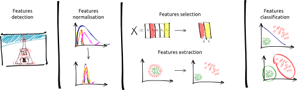

# B31XI - Scene Segmentation and Interpretation Syllabus

**Table of Contents** 
- [Information about the module](#information-about-the-module)
- [Course description](#course-description)
- [Course outline](#course-outline)
- [Additional material](#additional-material)

## Information about the module

* ViBOT - Universitat de Girona

* MsCV - Universite de Bourgogne
 * **Instructors:** Fabrice Meriaudeau, Robert Marti, Guillaume Lemaitre, Joan Massich,
 * **Contact:** [Contact email](mailto:g.lemaitre58@gmail.com) for personal queries.

## Course description

To provide a critical and practical understanding of the principle theories and concepts of scene analysis, from image segmentation, classification to scene description.

The following framework will be studied through the module:

## Course outline

### ViBOT

* Lecture sessions
* Practise sessions

### MsCV

* Lecture sessions
* Practise sessions
 1. [Features normalisation](https://github.com/ViBOT-Erasmus/B31XI-SI-Features-Normalisation)
 1. [Features selection](https://github.com/ViBOT-Erasmus/B31XI-SI-Features-Selection)
 1. [Features extraction](https://github.com/ViBOT-Erasmus/B31XI-SI-Features-Extraction)
 1. [Clustering](https://github.com/ViBOT-Erasmus/B31XI-SI-Clustering)
 1. [Probabilistic classifiers](https://github.com/ViBOT-Erasmus/B31XI-SI-Probabilistic-Classifiers)
 1. [Ensemble classifiers](https://github.com/ViBOT-Erasmus/B31XI-SI-Ensemble-Classifiers)

## Additional material

Supplement material can be found in the following wonderful books:

* [*Pattern Recognition*, S. Theodoridis and K. Koutroumbas](http://www.manalhelal.com/Books/F2014/Pattern%20Recognition_2003.pdf),
* [*Pattern Recognition*, R.O. Duda and P.E. Hart and D.G. Stork](http://cns-classes.bu.edu/cn550/Readings/duda-etal-00.pdf),
* [*Pattern Recognition and Machine Learning*, C.M. Bishop](http://www.rmki.kfki.hu/~banmi/elte/Bishop%20-%20Pattern%20Recognition%20and%20Machine%20Learning.pdf).

The following [guides](https://guides.github.com/) can be useful to use git and github.
